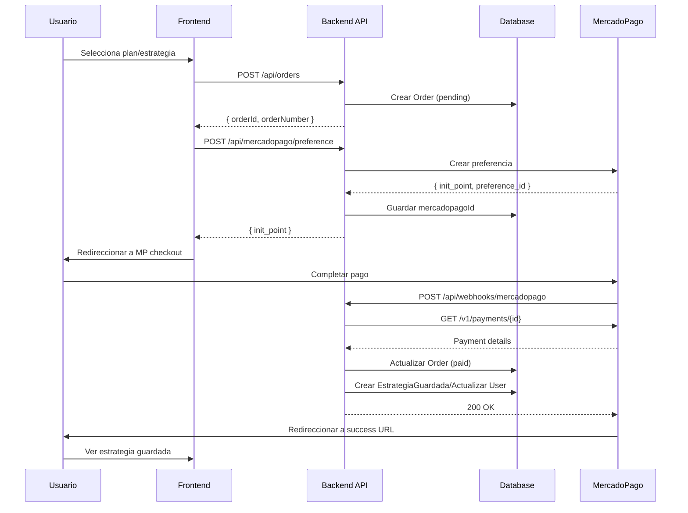

# Documentación de APIs

## 📋 Tabla de Contenidos

1. [APIs de Autenticación](#apis-de-autenticación)
2. [APIs de Estrategias](#apis-de-estrategias)
3. [APIs de Familiares](#apis-de-familiares)
4. [APIs YAM40](#apis-yam40)
5. [APIs de Órdenes y Pagos](#apis-de-órdenes-y-pagos)
6. [Webhooks MercadoPago](#webhooks-mercadopago)

---

## 🔐 APIs de Autenticación

### POST /api/auth/register

Registro de nuevo usuario con email y contraseña.

**Request Body:**
```json
{
  "name": "Juan Pérez",
  "email": "juan@example.com",
  "password": "SecurePass123!"
}
```

**Response 201:**
```json
{
  "message": "Usuario creado exitosamente",
  "user": {
    "id": "clx123abc",
    "name": "Juan Pérez",
    "email": "juan@example.com",
    "subscription": "free",
    "hasUsedFreeStrategy": false
  }
}
```

**Validaciones:**
- Email válido y único
- Contraseña mínimo 8 caracteres
- Nombre requerido

**Errores:**
- `400`: Datos inválidos o incompletos
- `409`: Email ya registrado

---

### POST /api/auth/forgot-password

Solicitar recuperación de contraseña.

**Request Body:**
```json
{
  "email": "juan@example.com"
}
```

**Response 200:**
```json
{
  "message": "Si el email existe, recibirás instrucciones de recuperación"
}
```

**Notas:**
- Siempre retorna 200 por seguridad
- Genera token temporal en BD
- Envía email con enlace de reseteo

---

### POST /api/auth/reset-password

Resetear contraseña con token.

**Request Body:**
```json
{
  "token": "abc123xyz789",
  "newPassword": "NewSecurePass123!"
}
```

**Response 200:**
```json
{
  "message": "Contraseña actualizada exitosamente"
}
```

**Errores:**
- `400`: Token inválido o expirado
- `400`: Contraseña no cumple requisitos

---

## 📊 APIs de Estrategias

### POST /api/calculate-strategies

Calcular estrategias de Modalidad 40 para un familiar.

**Request Body:**
```json
{
  "familyData": {
    "id": "clx456def",
    "name": "María García",
    "birthDate": "1970-05-15T00:00:00.000Z",
    "weeksContributed": 800,
    "lastGrossSalary": 15000,
    "civilStatus": "casado"
  },
  "filters": {
    "monthlyContributionRange": {
      "min": 3000,
      "max": 8000
    },
    "months": 58,
    "retirementAge": 65,
    "startMonth": 3,
    "startYear": 2025,
    "monthsMode": "scan"
  },
  "userPreferences": {
    "nivelUMA": "balanced",
    "pensionObjetivo": "comfortable"
  }
}
```

**Parámetros Detallados:**

**familyData:**
- `id`: ID del familiar (puede ser temporal si no está en BD)
- `birthDate`: Fecha de nacimiento en formato ISO
- `weeksContributed`: Semanas cotizadas ANTES de Modalidad 40 (mínimo 500)
- `lastGrossSalary`: Salario mensual bruto antes de M40
- `civilStatus`: 'soltero' | 'casado' | 'divorciado' | 'viudo'

**filters:**
- `monthlyContributionRange`: Rango de aportación mensual deseada (en MXN)
- `months`: Meses objetivo en M40 (1-58)
- `retirementAge`: Edad de jubilación deseada (60-65)
- `startMonth`: Mes de inicio M40 (1-12)
- `startYear`: Año de inicio M40
- `monthsMode`: 
  - `'fixed'`: Solo calcula estrategias con `months` especificados
  - `'scan'`: Calcula estrategias para 1 hasta `months` disponibles

**userPreferences (opcional):**
- `nivelUMA`: 
  - `'conservative'`: UMA 1-8
  - `'balanced'`: UMA 9-17
  - `'max'`: UMA 18-25
- `pensionObjetivo`:
  - `'basic'`: $8,000-$12,000
  - `'comfortable'`: $12,000-$18,000
  - `'premium'`: $18,000+

**Response 200:**
```json
{
  "strategies": [
    {
      "estrategia": "fijo",
      "umaElegida": 15,
      "mesesM40": 36,
      "pensionMensual": 14580,
      "ROI": 245.5,
      "inversionTotal": 87500,
      "pmgAplicada": false,
      "registros": [
        {
          "fecha": "2025-03-01",
          "uma": 15,
          "tasaM40": 0.13347,
          "sdiMensual": 1695.00,
          "cuotaMensual": 2430.50,
          "acumulado": 2430.50
        }
        // ... más meses
      ]
    }
    // ... más estrategias
  ],
  "count": 2450,
  "familyData": { /* echo de datos */ },
  "filters": { /* echo de filtros */ }
}
```

**Estructura de Estrategia:**
- `estrategia`: 'fijo' (UMA constante) o 'progresivo' (UMA creciente)
- `umaElegida`: Nivel UMA seleccionado (1-25)
- `mesesM40`: Duración en meses (1-58)
- `pensionMensual`: Pensión mensual estimada (MXN)
- `ROI`: Retorno de inversión (%)
- `inversionTotal`: Total a invertir (MXN)
- `pmgAplicada`: Si se aplicó Pensión Mínima Garantizada
- `registros`: Detalle mes a mes (opcional, solo si se solicita detalle)

**Validaciones:**
- Meses: 1-58
- Edad jubilación: 60-65
- Aportación mensual > 0
- Fecha nacimiento válida y edad >= 40 años
- Semanas cotizadas >= 250

**Errores:**
- `400`: Datos requeridos faltantes o inválidos
- `401`: No autorizado (solo para usuarios registrados en futuro)
- `500`: Error en cálculo

**Tiempos de Respuesta:**
- `monthsMode: 'fixed'`: ~1-2 segundos (50 estrategias)
- `monthsMode: 'scan'`: ~3-8 segundos (2000+ estrategias)

---

### POST /api/guardar-estrategia

Guardar una estrategia calculada.

**Autenticación:** Requerida

**Request Body:**
```json
{
  "debugCode": "integration_clx456_fijo_15_36_65_032025",
  "datosEstrategia": {
    "estrategia": "fijo",
    "umaElegida": 15,
    "mesesM40": 36,
    "pensionMensual": 14580,
    "ROI": 245.5,
    "inversionTotal": 87500,
    "registros": [ /* ... */ ]
  },
  "datosUsuario": {
    "nombreFamiliar": "María García",
    "fechaNacimiento": "1970-05-15",
    "edadJubilacion": 65,
    "semanasCotizadas": 800,
    "inicioM40": "2025-03-01"
  },
  "familyMemberId": "clx456def",
  "esMejora": false
}
```

**Response 200:**
```json
{
  "success": true,
  "estrategia": {
    "id": "clx789ghi",
    "debugCode": "integration_clx456_fijo_15_36_65_032025",
    "userId": "clx123abc",
    "familyMemberId": "clx456def",
    "activa": true,
    "visualizaciones": 0,
    "createdAt": "2025-02-15T10:30:00.000Z"
  },
  "linkCompartible": "https://app.com/estrategia/integration_clx456_fijo_15_36_65_032025"
}
```

**Lógica de Estrategia Gratis:**
- Usuarios `free`: 1 estrategia gratis, luego requiere compra o premium
- Usuarios `basic`: Ilimitadas si han comprado
- Usuarios `premium`: Ilimitadas

**Errores:**
- `400`: Datos incompletos
- `401`: No autorizado
- `403`: Ya usó estrategia gratis
- `404`: Usuario no encontrado
- `409`: Estrategia ya guardada (debugCode duplicado)
- `500`: Error al guardar

---

### POST /api/estrategia-compartible

Obtener estrategia guardada por código (sin autenticación).

**Request Body:**
```json
{
  "code": "integration_clx456_fijo_15_36_65_032025"
}
```

**Response 200:**
```json
{
  "estrategia": {
    "id": "clx789ghi",
    "debugCode": "integration_clx456_fijo_15_36_65_032025",
    "datosEstrategia": { /* ... */ },
    "datosUsuario": { /* ... */ },
    "visualizaciones": 15,
    "createdAt": "2025-02-15T10:30:00.000Z"
  }
}
```

**Errores:**
- `404`: Estrategia no encontrada
- `500`: Error interno

---

## 👨‍👩‍👧 APIs de Familiares

### GET /api/family

Listar familiares del usuario autenticado.

**Autenticación:** Requerida

**Response 200:**
```json
[
  {
    "id": "clx456def",
    "userId": "clx123abc",
    "name": "María García",
    "birthDate": "1970-05-15T00:00:00.000Z",
    "weeksContributed": 800,
    "lastGrossSalary": 15000,
    "civilStatus": "casado",
    "createdAt": "2025-01-10T08:00:00.000Z"
  },
  {
    "id": "clx789ghi",
    "name": "Pedro López",
    "birthDate": "1965-10-20T00:00:00.000Z",
    "weeksContributed": 950,
    "lastGrossSalary": 20000,
    "civilStatus": "soltero",
    "createdAt": "2025-01-15T09:30:00.000Z"
  }
]
```

**Errores:**
- `401`: No autorizado
- `500`: Error al obtener familiares

---

### POST /api/family

Crear nuevo familiar.

**Autenticación:** Requerida

**Request Body:**
```json
{
  "name": "Carlos Ramírez",
  "birthDate": "1968-08-12T00:00:00.000Z",
  "weeksContributed": 1200,
  "lastGrossSalary": 18500,
  "civilStatus": "casado"
}
```

**Validaciones:**
- `name`: Requerido, máximo 100 caracteres
- `birthDate`: Fecha válida, edad >= 40 años
- `weeksContributed`: >= 500
- `lastGrossSalary`: > 0
- `civilStatus`: 'soltero' | 'casado' | 'divorciado' | 'viudo'

**Response 201:**
```json
{
  "id": "clx101112",
  "userId": "clx123abc",
  "name": "Carlos Ramírez",
  "birthDate": "1968-08-12T00:00:00.000Z",
  "weeksContributed": 1200,
  "lastGrossSalary": 18500,
  "civilStatus": "casado",
  "createdAt": "2025-02-15T11:00:00.000Z"
}
```

**Errores:**
- `400`: Datos inválidos
- `401`: No autorizado
- `500`: Error al crear

---

### PUT /api/family/[id]

Actualizar familiar existente.

**Autenticación:** Requerida

**Request Body:**
```json
{
  "name": "Carlos Ramírez Actualizado",
  "weeksContributed": 1250,
  "lastGrossSalary": 19000
}
```

**Response 200:**
```json
{
  "id": "clx101112",
  "name": "Carlos Ramírez Actualizado",
  "birthDate": "1968-08-12T00:00:00.000Z",
  "weeksContributed": 1250,
  "lastGrossSalary": 19000,
  "civilStatus": "casado",
  "updatedAt": "2025-02-15T11:30:00.000Z"
}
```

**Errores:**
- `400`: Datos inválidos
- `401`: No autorizado
- `403`: No es propietario del familiar
- `404`: Familiar no encontrado
- `500`: Error al actualizar

---

### DELETE /api/family/[id]

Eliminar familiar.

**Autenticación:** Requerida

**Response 200:**
```json
{
  "message": "Familiar eliminado exitosamente"
}
```

**Notas:**
- También elimina todas las estrategias asociadas en cascada

**Errores:**
- `401`: No autorizado
- `403`: No es propietario
- `404`: Familiar no encontrado
- `500`: Error al eliminar

---

## 🔄 APIs YAM40

### POST /api/lista-sdi-yam40

Generar lista de SDI para cálculo YAM40.

**Request Body:**
```json
{
  "fechaInicioM40": {
    "mes": 2,
    "año": 2024
  },
  "fechaFinM40": {
    "mes": 12,
    "año": 2025
  },
  "tipoEstrategia": "fija",
  "valorInicial": 5000
}
```

**Parámetros:**
- `fechaInicioM40`: Primer mes de pago M40
- `fechaFinM40`: Último mes de pago M40
- `tipoEstrategia`: 
  - `'fija'`: Aportación constante
  - `'progresiva'`: UMA constante (SDI crece con inflación)
- `valorInicial`: 
  - Si `tipoEstrategia = 'fija'`: Aportación mensual (MXN)
  - Si `tipoEstrategia = 'progresiva'`: Nivel UMA (1-25)

**Response 200:**
```json
{
  "listaSDI": [
    {
      "mes": 2,
      "año": 2024,
      "sdi": 492.76,
      "uma": 14.5,
      "aportacionMensual": 5000,
      "estrategia": "fija"
    },
    {
      "mes": 3,
      "año": 2024,
      "sdi": 492.76,
      "uma": 14.5,
      "aportacionMensual": 5000,
      "estrategia": "fija"
    }
    // ... hasta fechaFinM40
  ],
  "totalMeses": 23,
  "promedioSDI": 492.76,
  "totalAportado": 115000
}
```

**Cálculo de SDI:**

**Estrategia Fija:**
```javascript
aportacionMensual = valorInicial
umaDelAño = getUMAHistorica(año)
tasaM40DelAño = getTasaM40(año)

sdi = (aportacionMensual / 30.4) / tasaM40DelAño
uma = sdi / umaDelAño
```

**Estrategia Progresiva:**
```javascript
umaConstante = valorInicial
umaDelAño = getUMAHistorica(año)

sdi = umaConstante * umaDelAño
aportacionMensual = sdi * 30.4 * getTasaM40(año)
```

**Errores:**
- `400`: Fechas inválidas o en orden incorrecto
- `400`: Tipo de estrategia inválido
- `400`: Valor inicial fuera de rango
- `500`: Error en cálculo

---

## 💳 APIs de Órdenes y Pagos

### POST /api/orders

Crear orden de compra (sin pago aún).

**Autenticación:** Requerida

**Request Body:**
```json
{
  "planType": "basic",
  "amount": 299,
  "strategyData": {
    "debugCode": "integration_clx456_fijo_15_36_65_032025",
    "familyMemberId": "clx456def",
    "estrategia": "fijo",
    "umaElegida": 15,
    "mesesM40": 36
  },
  "userData": {
    "familyMemberName": "María García"
  }
}
```

**Parámetros:**
- `planType`: 'basic' | 'premium'
- `amount`: Precio en MXN (decimal)
- `strategyData`: Datos de la estrategia a comprar (solo para basic)
- `userData`: Información adicional del usuario

**Response 201:**
```json
{
  "success": true,
  "order": {
    "id": "clx202122",
    "orderNumber": "ORD-2025-001",
    "status": "pending",
    "amount": 299,
    "planType": "basic",
    "expiresAt": "2025-02-16T12:00:00.000Z"
  }
}
```

**Generación de Order Number:**
```javascript
// Formato: ORD-YYYY-XXX
// XXX = contador secuencial del año (001, 002, ...)
const año = new Date().getFullYear()
const ultimaOrdenAño = await prisma.order.findFirst({
  where: { orderNumber: { startsWith: `ORD-${año}` } },
  orderBy: { orderNumber: 'desc' }
})
const contador = ultimaOrdenAño 
  ? parseInt(ultimaOrdenAño.orderNumber.split('-')[2]) + 1
  : 1
const orderNumber = `ORD-${año}-${contador.toString().padStart(3, '0')}`
```

**Orden Expira:**
- Automáticamente después de 24 horas si no se paga
- Status cambia a `expired`

**Errores:**
- `400`: Datos inválidos
- `401`: No autorizado
- `500`: Error al crear orden

---

### GET /api/orders

Obtener órdenes del usuario.

**Autenticación:** Requerida

**Query Params (opcionales):**
- `limit`: Número de órdenes (default: 10)
- `status`: Filtrar por status

**Response 200:**
```json
{
  "success": true,
  "orders": [
    {
      "id": "clx202122",
      "orderNumber": "ORD-2025-001",
      "status": "paid",
      "planType": "basic",
      "amount": 299,
      "createdAt": "2025-02-15T12:00:00.000Z",
      "updatedAt": "2025-02-15T12:15:00.000Z",
      "orderItems": [
        {
          "id": "clx303132",
          "itemType": "strategy",
          "itemName": "Estrategia Modalidad 40",
          "quantity": 1,
          "unitPrice": 299,
          "totalPrice": 299
        }
      ]
    }
  ]
}
```

**Estados de Orden:**
- `pending`: Creada, esperando pago
- `paid`: Pagada exitosamente
- `failed`: Pago rechazado
- `cancelled`: Cancelada por usuario
- `expired`: Expiró sin pagar (24h)

---

### POST /api/mercadopago/preference

Crear preferencia de pago en MercadoPago.

**Autenticación:** Requerida

**Request Body:**
```json
{
  "orderId": "clx202122",
  "amount": 299,
  "strategyData": { /* ... */ },
  "userData": { /* ... */ }
}
```

**Response 200:**
```json
{
  "init_point": "https://www.mercadopago.com.mx/checkout/v1/redirect?pref_id=123456-abc123-...",
  "preference_id": "123456-abc123-def456",
  "order_id": "clx202122"
}
```

**Proceso:**
1. Valida que la orden existe y pertenece al usuario
2. Verifica que no ha expirado
3. Crea preferencia en MercadoPago con:
   - `items`: Producto descriptivo
   - `external_reference`: Order number
   - `back_urls`: URLs de retorno (solo en producción)
   - `notification_url`: Webhook URL
   - `payer`: Datos del usuario
4. Guarda `mercadopagoId` (preference ID) en orden
5. Retorna `init_point` para redirección

**URLs de Retorno:**
- **Desarrollo**: URLs genéricas de MercadoPago
- **Producción**: 
  - Success: `/pago-exitoso`
  - Pending: `/pago-pendiente`
  - Failure: `/pago-error`

**Errores:**
- `400`: orderId o amount faltante
- `400`: Orden expirada
- `401`: No autorizado
- `403`: Orden no pertenece al usuario
- `404`: Orden no encontrada
- `500`: Error creando preferencia MP

---

## 🔔 Webhooks MercadoPago

### POST /api/webhooks/mercadopago

Endpoint para recibir notificaciones de MercadoPago.

**Headers:**
- `x-signature`: Firma HMAC del webhook
- `x-request-id`: ID único del request
- `user-agent`: MercadoPago crawler

**Query Params:**
- `data.id` o `id`: ID del pago o merchant order
- `type` o `topic`: Tipo de notificación

**Tipos de Webhooks:**

#### 1. Payment Webhook

**Query:** `?data.id=123456&type=payment`

**Payload:**
```json
{
  "id": 123456,
  "live_mode": true,
  "type": "payment",
  "date_created": "2025-02-15T12:15:00.000Z",
  "user_id": 789012,
  "api_version": "v1",
  "action": "payment.created",
  "data": {
    "id": "123456"
  }
}
```

**Proceso:**
1. Validar firma (si `MERCADOPAGO_WEBHOOK_SECRET` configurado)
2. Obtener detalles del pago: `GET /v1/payments/{id}`
3. Buscar orden por `external_reference`
4. Si pago aprobado:
   - Actualizar orden: `status = 'paid'`, `paymentId = payment.id`
   - Si `planType = 'basic'`: Crear `EstrategiaGuardada`
   - Si `planType = 'premium'`: Actualizar `User.subscription = 'premium'`
5. Si pago rechazado:
   - Actualizar orden: `status = 'failed'`
6. Retornar 200 (siempre, para confirmar recepción)

#### 2. Merchant Order Webhook

**Query:** `?id=123456&topic=merchant_order`

**Payload:**
```json
{
  "type": "merchant_order",
  "id": "123456",
  "data": {
    "id": "123456"
  }
}
```

**Proceso:**
1. Consultar merchant order: `GET /merchant_orders/{id}`
2. Obtener `preference_id` y `external_reference`
3. Buscar orden en BD
4. Obtener pagos asociados
5. Procesar cada pago (igual que payment webhook)

**Validación de Firma:**
```javascript
// Formato de firma: ts=<timestamp>,v1=<hash>
const manifest = `id:${dataId};request-id:${xRequestId};ts:${ts};`
const expectedHash = crypto
  .createHmac('sha256', WEBHOOK_SECRET)
  .update(manifest)
  .digest('hex')
```

**Idempotencia:**
- Si orden ya tiene `status = 'paid'`, no reprocesar
- Si payment ID ya existe, ignorar notificación duplicada

**Response:**
```json
{
  "success": true,
  "message": "Webhook processed successfully",
  "timestamp": "2025-02-15T12:15:30.000Z",
  "orderId": "clx202122",
  "paymentId": "123456"
}
```

**Manejo de Errores:**
- Siempre retornar `200` para confirmar recepción
- Loguear errores internos sin fallar el webhook
- MercadoPago reintenta si recibe 4xx/5xx

---

## 📊 Flujo Completo de Compra



---

## 🔒 Seguridad y Mejores Prácticas

### Rate Limiting
- Implementar en endpoints públicos
- Límites sugeridos:
  - `/api/calculate-strategies`: 10 req/min
  - `/api/auth/register`: 5 req/min
  - `/api/webhooks/*`: Sin límite (MercadoPago)

### CORS
```javascript
// next.config.js
module.exports = {
  async headers() {
    return [
      {
        source: '/api/:path*',
        headers: [
          { key: 'Access-Control-Allow-Origin', value: process.env.NEXTAUTH_URL },
          { key: 'Access-Control-Allow-Methods', value: 'GET,POST,PUT,DELETE,OPTIONS' },
        ],
      },
    ]
  },
}
```

### Validación de Entrada
- Usar Zod para validación de schemas
- Sanitizar inputs SQL injection
- Validar tipos TypeScript

### Logs y Monitoreo
- Loguear todas las operaciones de pago
- Monitorear tiempos de respuesta
- Alertas para errores críticos

---

**Última actualización**: Febrero 2025
