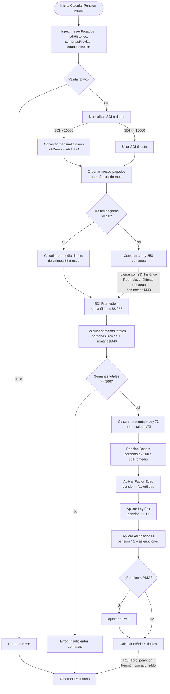
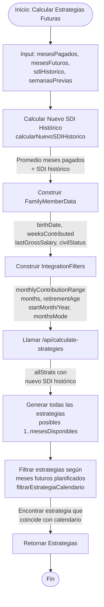
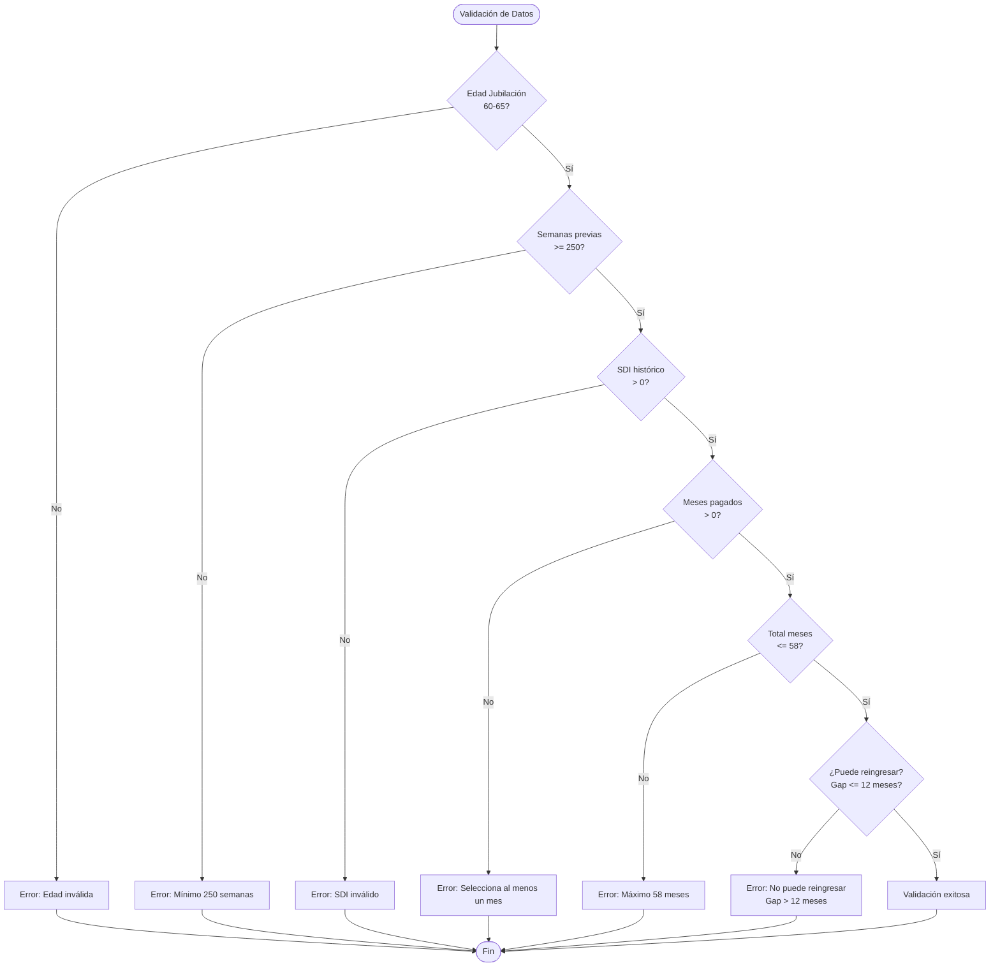
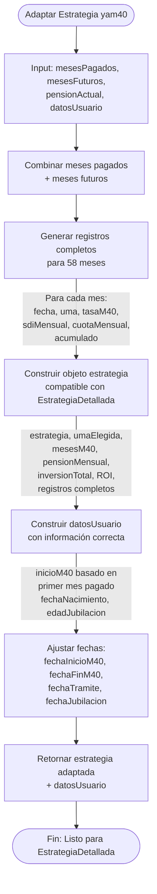
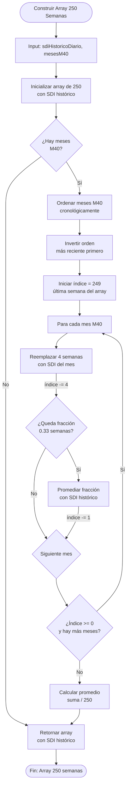

# Diagrama de Flujo Completo - Sistema yam40

## Flujo Principal del Usuario

```mermaid
flowchart TD
    Start([Usuario entra a yam40]) --> Step1[Paso 1: Información Básica]
    
    Step1 --> UserProfile[UserProfileCard]
    UserProfile --> |Nombre, Fecha Nacimiento<br/>Edad Jubilación<br/>Semanas Cotizadas| SDIInput[SDIHistoricoInput]
    
    SDIInput --> |SDI Histórico<br/>Meses Pagados| Validate1{Validar Datos}
    
    Validate1 --> |Incompleto| Step1
    Validate1 --> |Completo| Step2[Paso 2: Calendario]
    
    Step2 --> Calendar[M40Calendar]
    Calendar --> |Seleccionar meses pagados| CalcPension[Calcular Pensión Actual]
    
    CalcPension --> |mesesPagados| CheckPeriodos{¿Hay períodos<br/>históricos?}
    
    CheckPeriodos --> |Sí| APIHist[/api/calculate-historical-pension]
    CheckPeriodos --> |No| CalcLocal[calcularPensionActual]
    
    APIHist --> PensionResult[Resultado Pensión Actual]
    CalcLocal --> PensionResult
    
    PensionResult --> CheckLimitantes[Calcular Limitantes M40]
    CheckLimitantes --> |calcularLimitantesM40| Retroactivos{¿Hay meses<br/>retroactivos?}
    
    Retroactivos --> |Sí| AddRetro[Agregar meses retroactivos<br/>a mesesConSDI]
    Retroactivos --> |No| CheckFuturos{¿Hay meses<br/>futuros planificados?}
    
    AddRetro --> CheckFuturos
    
    CheckFuturos --> |Sí| CalcFuturos[Calcular Estrategias Futuras]
    CheckFuturos --> |No| Results[YaM40Results]
    
    CalcFuturos --> |construirFamilyMemberData<br/>construirIntegrationFilters| APIStrategies[/api/calculate-strategies]
    APIStrategies --> |allStrats| FilterStrategies[Filtrar Estrategias<br/>según calendario]
    FilterStrategies --> Results
    
    Results --> ShowPension[Mostrar Pensión Actual]
    ShowPension --> ShowOptions[Mostrar Opciones de Mejora]
    ShowOptions --> UserAction{¿Usuario quiere<br/>ver detalles?}
    
    UserAction --> |Sí| AdaptStrategy[Adaptar Estrategia para<br/>EstrategiaDetallada]
    UserAction --> |No| End([Fin])
    
    AdaptStrategy --> EstrategiaDetallada[EstrategiaDetallada<br/>PDF/Detalles]
    EstrategiaDetallada --> End
```

## Flujo de Cálculo de Pensión Actual



## Flujo de Cálculo de Estrategias Futuras



## Flujo de Validación y Limitantes

```mermaid
flowchart TD
    Start([Inicio: Validar Limitantes M40]) --> Input[Input: mesesPagados, fechaActual]
    
    Input --> CheckEmpty{¿Hay meses<br/>pagados?}
    
    CheckEmpty --> |No| Allow[Permitir inicio normal<br/>puedeReingresar = true]
    CheckEmpty --> |Sí| FindLast[Encontrar último mes pagado<br/>por fecha real]
    
    FindLast --> CalcLimit[Calcular fecha límite<br/>reingreso = últimoPago + 12 meses]
    
    CalcLimit --> CheckLimit{¿Fecha actual<br/>> límite?}
    
    CheckLimit --> |Sí| Deny[No puede reingresar<br/>puedeReingresar = false<br/>mensajeError]
    CheckLimit --> |No| CheckTotal{¿Total meses<br/>>= 58?}
    
    CheckTotal --> |Sí| NoRetro[No hay retroactivos<br/>mesesRetroactivos = []]
    CheckTotal --> |No| CheckGap{¿Hay gap temporal<br/>entre último pago<br/>y fecha actual/inicio?}
    
    CheckGap --> |No| NoRetro
    CheckGap --> |Sí| CalcRetro[Calcular meses retroactivos<br/>desde mes siguiente al último<br/>hasta fecha límite]
    
    CalcRetro --> ValidateRetro{¿Total + retroactivos<br/>> 58?}
    
    ValidateRetro --> |Sí| LimitRetro[Limitar retroactivos<br/>a 58 - total]
    ValidateRetro --> |No| ReturnRetro[Retornar meses retroactivos]
    
    LimitRetro --> ReturnRetro
    Allow --> Return[Retornar Resultado]
    Deny --> Return
    NoRetro --> Return
    ReturnRetro --> Return
```

## Casos Edge y Validaciones



## Flujo de Adaptación para EstrategiaDetallada



## Flujo de Construcción de Array 250 Semanas



## Resumen de Componentes y sus Responsabilidades

### YaM40Flow
- **Responsabilidad:** Orquestar el flujo completo
- **Estados:** 'profile' | 'calendar'
- **Transiciones:** Validar datos → Avanzar a calendario

### UserProfileCard
- **Responsabilidad:** Capturar información básica del usuario
- **Datos:** Nombre, fecha nacimiento, edad jubilación, semanas cotizadas, estado civil

### SDIHistoricoInput
- **Responsabilidad:** Capturar SDI histórico y meses pagados
- **Datos:** SDI histórico (directo o desde salario), meses pagados históricos

### M40Calendar
- **Responsabilidad:** Mostrar calendario de 58 meses y permitir selección
- **Funciones:** 
  - Calcular pensión actual
  - Calcular estrategias futuras
  - Manejar meses retroactivos
  - Validar límites

### YaM40Results
- **Responsabilidad:** Mostrar resultados y opciones de mejora
- **Funciones:**
  - Mostrar pensión actual destacada
  - Mostrar estrategias futuras disponibles
  - Permitir ver detalles completos

### EstrategiaDetallada
- **Responsabilidad:** Mostrar detalles completos de una estrategia
- **Requiere:** Adaptador para manejar meses ya pagados

## Puntos de Integración con APIs

1. **calculate-current-pension:** Se llama cuando hay meses pagados seleccionados
2. **calculate-strategies:** Se llama para generar estrategias futuras
3. **calculate-historical-pension:** Se llama si hay períodos históricos con UMA variable
4. **calculate-pension-array:** Se usa internamente para validación (no directamente desde frontend)

## Manejo de Errores

- **Validación temprana:** Validar datos antes de llamar APIs
- **Mensajes claros:** Errores en lenguaje simple para usuarios
- **Fallbacks:** Si una API falla, mostrar mensaje y permitir reintentar
- **Logging:** Registrar errores para debugging sin exponer detalles técnicos al usuario

